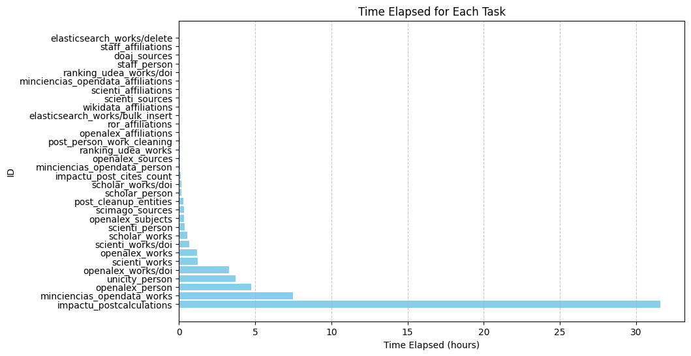

# Release de datos Colav/ImpactU (12/08/2024)

## Información de los datos

* De los datos se scienti se tomaron los productos 111 (Artículos publicado en revista especializa), los datos fueron sacado de los dumps de datos de Oracle dados por las instituciones.
* De openalex se tomó un corte de datos con las siguientes características:
    * Todos los productos de autores e instituciones Colombianas
    * Productos de las revistas Colombianas
    * Productos con doi de scholar, scienti y ranking.
    * De los datos abiertos de minciencias productos con categorías  = ['ART-00', 'ART-ART_A1', 'ART-ART_A2', 'ART-ART_B', 'ART-ART_C', 'ART-ART_D', 'ART-GC_ART', 'PE-PE', 'PID-00', 'PIC-00', 'PID-PID', 'PE-00', 'PF-00', 'PID-EX', 'PIC-PIC', 'PF-PF', 'PF-EX']  para este se hizo un desarrollo especial para procesar con elasticsaerch (ver https://github.com/colav-playground/openalex_load y https://github.com/colav/mohan)
* De openalex no se filtró por tipo de dato, por lo que quedaron [
  'article',         'book',
  'book-chapter',    'dataset',
  'dissertation',    'editorial',
  'erratum',         'letter',
  'other',           'paratext',
  'peer-review',     'preprint',
  'reference-entry', 'report',
  'review',          'standard'
]

* Se hizo un plugin de unicidad para person que permite hacer unicidad a través de:
    * Orcid
    * Google Scholar profile id
    * Research Gate 
    * Scopus
    * DOI: se unifican trabajos de diferentes fuentes con el mismo doi y sus autores se les hacer merge, se deja el autor con mejor información. Se puede hacer seguimiento de los autores que fueron unificados a través de las colecciones  **person_merged** y **person_merged_sets**

## Información de los post calculations

* Redes de coautoría para afiliaciones y autores se hicieron con 10 coautores.
* Se corrigió el problema de almacenamiento de redes muy grandes, las "edges" se partieron en dos colecciones
* Todo se paralelizó con multiprocessing para aumentar el rendimiento.

## Milestones and Issues
En total 53 issues asociados a este milestone
https://github.com/colav/impactu/milestone/1

## Datos usados
* **doaj_2024**
   - Usada para fuentes de datos de DOAJ (`stage`).

* **scienti_111**
   - Usada para productos (`product_udea`, `product_uec`, `product_unaula`, `product_univalle`) y afiliaciones Scienti.

* **openalexco**
   - Usada para fuentes (`sources`), conceptos (`concepts`), afiliaciones (`institutions`), autores (`authors`), y trabajos (`works`).

* **ror_2024**
   - Usada para afiliaciones ROR (`stage`).

* **wikidata**
   - Usada para afiliaciones en Wikidata (`data`).

* **yuku**
   - Usada para datos de afiliaciones y personas de Minciencias OpenData (`gruplac_groups_data`, `cvlac_data`, `cvlac_stage`, `gruplac_production_data`).

* **scholar_colombia_2024**
   - Usada para datos de personas y trabajos en Scholar Colombia (`stage`).

* **scimago**
    - Archivos CSV de Scimago desde 1999 hasta 2024.

* **staff**
    - Archivos Excel de datos de personal y afiliaciones para diversas instituciones (`Base de Datos profesores 2024`, `Maestro_empleado DOCENTES SEP 26_NORMALIZADO_univalle_2023`, etc.).
12. **ranking**
    - Usada para datos de producción (`produccion 2018-2023.xlsx`).
    Solo Universidad de Antioquia, las otras instituciones no entregaron los datos.

# Release de paquetes

### Metapaquete impactu
* Kahi_impactu/v0.0.12

### Kahi plugins
* Kahi == 0.0.10a0
* Kahi_doaj_sources == 0.1.1-beta
* Kahi_elasticsearch_works == 0.1.0-beta
* Kahi_impactu == 0.1.0
* Kahi_impactu_postcalculations == 0.1.1
* Kahi_impactu_post_cites_count == 0.0.2-alpha
* Kahi_minciencias_opendata_affiliations == 0.1.2-beta
* Kahi_minciencias_opendata_person == 0.1.3-beta
* Kahi_minciencias_opendata_works == 0.1.0-beta
* Kahi_openalex_affiliations == 0.1.2-beta
* Kahi_openalex_person == 0.1.4-beta
* Kahi_openalex_sources == 0.1.2-beta
* Kahi_openalex_subjects == 0.1.1-beta
* Kahi_openalex_works == 0.1.7-beta
* Kahi_post_cleanup_entities == 0.0.1-alpha
* Kahi_post_person_work_cleaning == 0.0.1-alpha
* Kahi_ranking_udea_works == 0.1.3-beta
* Kahi_ror_affiliations == 0.1.3-beta
* Kahi_scholar_person == 0.0.1-beta
* Kahi_scholar_works == 0.1.4-beta
* Kahi_scienti_affiliations == 0.1.3-beta
* Kahi_scienti_person == 0.1.5-beta
* Kahi_scienti_sources == 0.1.2-beta
* Kahi_scienti_works == 0.1.5-beta
* Kahi_scimago_sources == 0.1.0-beta
* Kahi_staff_affiliations == 0.1.2-beta
* Kahi_staff_person == 0.1.4-beta
* Kahi_unicity_person == 0.0.1-beta
* Kahi_wikidata_affiliations == 0.1.1-beta

### Workflow 
https://github.com/colav/impactu/blob/main/workflows/impactu/kahi_impactu_dev_12_08_2024.yml

# Tiempos de ejecución del workflow
En total son 56.65 horas.

# Problemas conocidos
Para este release algunos issues se quedan pendientes,
se pueden ver el milestone del siguiente release
https://github.com/colav/impactu/milestone/5

# Reporta
**Omar Zapata** grupocolav@udea.edu.co

